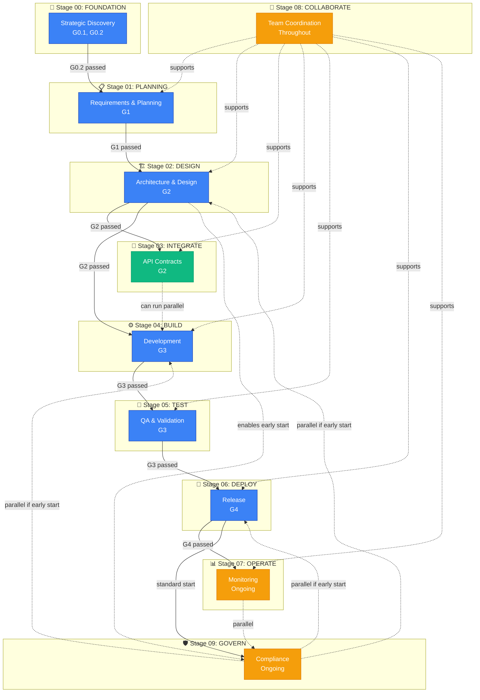

# SDLC Stage Dependency Matrix

**Status**: APPROVED
**Date**: January 28, 2026
**Framework Version**: SDLC 6.1.1
**Deciders**: CTO (Tai), CPO, Framework Maintainers
**Related**: SDLC Core Methodology, 10-Stage Lifecycle, Quality Gates
**Supersedes**: Implicit stage dependencies (inferred from gates only)

---

## Context

### Problem Statement

SDLC Framework 6.1.1 defines a **10-stage lifecycle** (00-FOUNDATION through 09-GOVERN) with **quality gates** (G0.1, G0.2, G1, G2, G3, G4) but lacks **explicit documentation** of:

1. **Stage dependencies** - Which stages must complete before others can start?
2. **Parallel execution rules** - Which stages can run concurrently?
3. **Early start triggers** - When can a stage start before its standard dependency?
4. **Failure recovery paths** - What happens when a stage fails?

**Current State**: Teams infer dependencies from:
- Gate documentation (G1 must pass before Stage 02 → Stage 03)
- Folder numbering (00 → 01 → 02 implies sequence)
- Implicit knowledge ("you can't deploy before testing")

**Business Impact**:
- Sprint planning confusion (a sprint crossed Stages 02 → 03 → 04 with no transition documentation)
- Stage skip decisions ambiguous (LITE tier: "Stage 03 optional" but no guidance on consequences)
- Tooling gaps (SDLC CLI tools cannot validate stage prerequisites)
- Onboarding friction (new teams guess stage sequencing)

### Forces

**Balancing Factors**:

| Force | Direction | Rationale |
|-------|-----------|-----------|
| **Clarity** | Explicit dependencies | Teams need clear stage prerequisites |
| **Flexibility** | Allow parallel stages | Stage 08 (COLLABORATE) runs throughout |
| **Safety** | Enforce prerequisites | Can't deploy untested code |
| **Speed** | Enable early starts | Stage 09 (GOVERN) can start at Stage 01 for regulated industries |
| **Simplicity** | Avoid over-prescription | Not every project needs all 10 stages |
| **Tooling** | Machine-readable format | SDLC CLI tools need to parse dependencies |

---

## Decision

### Stage Dependency Matrix (YAML)

**Format**: Structured YAML for both human readability and tool parsing.

```yaml
# SDLC 6.1.1 Stage Dependency Matrix
# Each stage defines: requires, enables, gates, parallel rules, triggers

stages:
  00-FOUNDATION:
    name: "Strategic Discovery"
    requires: []  # First stage, no dependencies
    prerequisite_gates: []
    enables:
      - 01-PLANNING
    parallel_ok: false
    exit_gates: [G0.1, G0.2]
    typical_duration: "1-2 weeks (LITE: 2-3 days)"
    failure_recovery: "Refine problem statement, conduct more user research"

  01-PLANNING:
    name: "Requirements & Architecture Planning"
    requires:
      - 00-FOUNDATION
    prerequisite_gates: [G0.2]
    enables:
      - 02-DESIGN
      - 08-COLLABORATE  # Can start collaboration during planning
    parallel_ok: false
    exit_gates: [G1]
    typical_duration: "1-2 weeks (LITE: 3-5 days)"
    failure_recovery: "Return to 00-FOUNDATION if requirements unclear"

  02-DESIGN:
    name: "Architecture & Technical Design"
    requires:
      - 01-PLANNING
    prerequisite_gates: [G1]
    enables:
      - 03-INTEGRATE
      - 04-BUILD
      - 09-GOVERN  # Governance can start during design (ADR reviews)
    parallel_ok: false
    exit_gates: [G2]
    typical_duration: "1-2 weeks (LITE: 2-4 days)"
    failure_recovery: "Revise ADRs, conduct more design reviews"

  03-INTEGRATE:
    name: "API Contracts & Integration Points"
    requires:
      - 02-DESIGN
    prerequisite_gates: [G2]
    enables:
      - 04-BUILD
    parallel_ok: true  # Can run parallel to Stage 04 (BUILD)
    parallel_stages: [04-BUILD]
    exit_gates: [G2]  # Same gate as Stage 02, validates integration design
    typical_duration: "1 week (LITE: 1-2 days or SKIP)"
    skip_conditions:
      - "No third-party APIs"
      - "Monolithic application"
      - "No microservices"
    failure_recovery: "Update API contracts, revise integration architecture"

  04-BUILD:
    name: "Development & Implementation"
    requires:
      - 02-DESIGN
    prerequisite_gates: [G2]
    enables:
      - 05-TEST
    parallel_ok: true
    parallel_stages: [03-INTEGRATE, 08-COLLABORATE]
    exit_gates: [G3]  # Code complete, ready for testing
    typical_duration: "2-8 weeks (depends on scope)"
    failure_recovery: "Refactor, address code review feedback"

  05-TEST:
    name: "Quality Assurance & Validation"
    requires:
      - 04-BUILD
    prerequisite_gates: [G3]
    enables:
      - 06-DEPLOY
    parallel_ok: false
    exit_gates: [G3]  # Same gate, validates test coverage
    typical_duration: "1-2 weeks (LITE: 2-3 days or SKIP)"
    skip_conditions:
      - "Unit tests only, single developer"
      - "Internal prototype, no production deployment"
    skip_risk: "HIGH - No QA validation, bugs reach production"
    failure_recovery: "Fix failing tests, add missing test coverage"

  06-DEPLOY:
    name: "Release & Production Deployment"
    requires:
      - 05-TEST
    prerequisite_gates: [G3]  # Tests must pass before deploy
    enables:
      - 07-OPERATE
      - 09-GOVERN  # Governance audits start post-deploy
    parallel_ok: false
    exit_gates: [G4]  # Deployment successful
    typical_duration: "1-3 days (LITE: 1 day or SKIP)"
    skip_conditions:
      - "Local development only"
      - "No production users"
    skip_risk: "MEDIUM - No production deployment strategy"
    failure_recovery: "Rollback deployment, fix production issues"

  07-OPERATE:
    name: "Monitoring & Operations"
    requires:
      - 06-DEPLOY
    prerequisite_gates: [G4]
    enables:
      - 09-GOVERN  # Ongoing governance during operations
    parallel_ok: true
    parallel_stages: [08-COLLABORATE, 09-GOVERN]
    exit_gates: []  # Ongoing stage, no exit gate
    typical_duration: "Ongoing (throughout product lifecycle)"
    skip_conditions:
      - "No production monitoring needed"
      - "Internal tool, no SLA requirements"
    skip_risk: "HIGH - No production monitoring, outages undetected"
    failure_recovery: "Incident response, post-mortem analysis"

  08-COLLABORATE:
    name: "Team Coordination & Knowledge Sharing"
    requires: []  # No hard dependency, runs throughout
    prerequisite_gates: []
    enables: []  # Supports all stages, doesn't enable specific stages
    parallel_ok: true
    parallel_stages: [01-PLANNING, 02-DESIGN, 03-INTEGRATE, 04-BUILD, 05-TEST, 06-DEPLOY, 07-OPERATE]
    triggers:
      - "Team size > 1 developer"
      - "External stakeholder involvement (PM, designer, QA)"
      - "Cross-team dependency detected"
      - "Knowledge transfer required"
    activities:
      - "Code review coordination"
      - "Daily standups / sprint ceremonies"
      - "Knowledge sharing sessions"
      - "Conflict resolution"
      - "Cross-team synchronization"
    exit_gates: []  # Ongoing, no exit
    typical_duration: "Throughout project lifecycle"
    skip_conditions:
      - "Solo developer, no team"
      - "No external stakeholders"
    skip_risk: "LOW - But reduces code quality (no reviews)"
    failure_recovery: "N/A (ongoing activities)"

  09-GOVERN:
    name: "Compliance & Governance"
    requires:
      - 06-DEPLOY  # Standard start: post-deployment audits
    prerequisite_gates: [G4]
    early_start_triggers:
      - "Regulated industry (healthcare, finance, government)"
      - "SOC 2 / HIPAA / GDPR compliance required"
      - "AI/ML system (AI Governance Principles 1-6 required)"
      - "Security-critical application"
    early_start_stage: 01-PLANNING  # Can start as early as planning for regulated industries
    parallel_ok: true
    parallel_stages: [02-DESIGN, 04-BUILD, 06-DEPLOY, 07-OPERATE]
    activities:
      early_phase:
        - "Compliance requirements analysis"
        - "Audit preparation"
        - "Policy definition"
        - "ADR compliance reviews"
        - "Security audit planning"
      standard_phase:
        - "Audit execution"
        - "Compliance verification"
        - "Certification (SOC 2, ISO 27001, etc.)"
        - "Post-deployment reviews"
    exit_gates: []  # Ongoing governance
    typical_duration: "Ongoing (throughout product lifecycle)"
    skip_conditions:
      - "Internal tool, no compliance requirements"
      - "No regulated data"
      - "No AI/ML components"
    skip_risk: "CRITICAL - Legal/compliance violations possible"
    failure_recovery: "Remediation plan, compliance gap closure"
```

### Stage Dependency Diagram (Mermaid)

**Visual representation of stage dependencies and parallel execution:**



### Gate-Stage Mapping

**Quality gates validate stage transitions:**

| Gate | Name | Validates Transition | Exit Criteria |
|------|------|----------------------|---------------|
| **G0.1** | Problem Validated | Start → Stage 00 | Problem statement validated |
| **G0.2** | Solutions Explored | Stage 00 → Stage 01 | Business case approved, user research complete |
| **G1** | Legal + Market Validated | Stage 01 → Stage 02 | Requirements documented, API specs drafted |
| **G2** | Architecture Validated | Stage 02 → Stage 03/04 | ADRs approved, architecture reviewed |
| **G3** | Code + Tests Validated | Stage 04 → Stage 05 → Stage 06 | Code complete, tests passing |
| **G4** | Deployed Successfully | Stage 06 → Stage 07 | Production deployment successful |

---

## Consequences

### Benefits

✅ **Clarity**: Explicit dependencies remove ambiguity for stage transitions  
✅ **Tooling**: SDLC CLI tools can validate stage prerequisites automatically
✅ **Flexibility**: `parallel_ok` and `early_start_triggers` enable complex workflows  
✅ **Safety**: Prerequisite gates prevent unsafe transitions (deploy before testing)  
✅ **Guidance**: Skip conditions and risk levels help LITE tier decisions  
✅ **Onboarding**: New teams understand stage sequencing immediately  

### Risks

⚠️ **Complexity**: 10 stages with parallel rules may overwhelm small teams  
   - *Mitigation*: LITE tier guidance (Stages 00, 01, 02, 04 required only)

⚠️ **Rigidity**: Explicit dependencies may feel too prescriptive  
   - *Mitigation*: `parallel_ok` and `early_start_triggers` provide flexibility

⚠️ **Maintenance**: Dependency matrix must stay synchronized with Framework updates  
   - *Mitigation*: This document is canonical reference, auto-validated by CI

### Implementation Requirements

**Framework (SDLC-Enterprise-Framework)**:
1. Create this document as canonical reference
2. Update CONTENT-MAP.md with canonical entry
3. Update CHANGELOG.md for SDLC 6.1.1 release
4. Create Stage-Exit-Criteria.md (separate document, references this ADR)

**Orchestrator (Automation Layer)**:
1. SDLC CLI validator: Add stage prerequisite validation
2. Sprint planning templates: Include stage transition tracking
3. Current sprint plan: Add stage tracking fields

**Tooling**:
```bash
# Example SDLC CLI commands (implementation-specific)
[SDLC CLI] validate --stage-transition 02 03  # Validate Stage 02 → 03 transition
[SDLC CLI] show-dependencies --stage 04       # Show Stage 04 prerequisites
[SDLC CLI] check-skip-safe --stage 05 --tier LITE  # Check if safe to skip Stage 05
```

---

## Related Documents

**Framework**:
- [SDLC-Core-Methodology.md](../SDLC-Core-Methodology.md) - 10-Stage lifecycle definition
- [SDLC-Stage-Exit-Criteria.md](../SDLC-Stage-Exit-Criteria.md) - Stage completion criteria (NEW)
- [SDLC-Stage-Sprint-Integration.md](../Governance-Compliance/SDLC-Stage-Sprint-Integration.md) - Sprint-stage mapping (NEW)
- [SDLC-Tier-Stage-Requirements.md](../Documentation-Standards/SDLC-Tier-Stage-Requirements.md) - LITE tier guidance (NEW)

**Orchestrator**:
- Orchestrator sprint completion summaries - Real examples of multi-stage sprints

**Quality Gates**:
- G0.1, G0.2: Foundation gates
- G1: Legal + Market gate
- G2: Architecture gate
- G3: Code + Tests gate
- G4: Deployment gate

---

## Version History

| Version | Date | Changes | Author |
|---------|------|---------|--------|
| 1.0 | 2026-01-28 | Initial version - Explicit stage dependencies | CTO (Tai) |

---

## Approval

**CTO Review**: ✅ APPROVED  
**CPO Review**: ⏳ Pending  
**Framework Maintainers**: ⏳ Pending  

**Release**: SDLC 6.1.1 (January 28, 2026)
