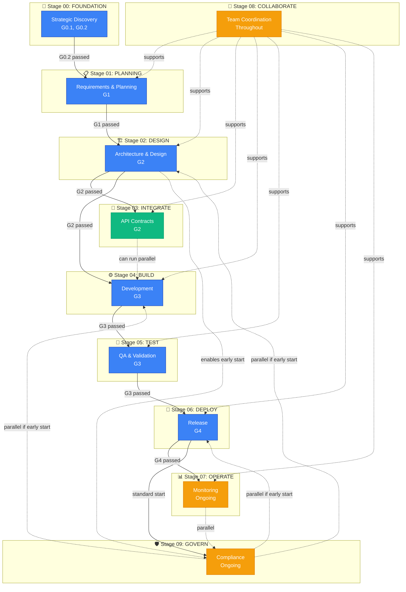

# SDLC Stage Lifecycle Framework

> **Ring 1 (Core)** — Unified reference for stage dependencies, exit criteria, and tier requirements.
> Consolidates three 6.3.0 documents into one source of truth.

## Tier Definitions (Single Source — referenced throughout)

| Tier | Team Size | Description | Required Stages | Skip Risk Tolerance |
|------|-----------|-------------|----------------|-------------------|
| **LITE** | 1-2 developers | Prototypes, MVPs, internal tools | 00, 01, 02, 04 | HIGH (speed > process) |
| **STANDARD** | 3-5 developers | Small production apps | 00-06 | MEDIUM |
| **PROFESSIONAL** | 3-10 developers | Production apps, moderate complexity | 00-07 | LOW |
| **ENTERPRISE** | 10+ developers | Regulated industries, high complexity | All 10 (00-09) | ZERO |

## Stage Enumeration (Single Source — referenced throughout)

| # | Stage | Business Question | Gate |
|---|-------|-------------------|------|
| 00 | FOUNDATION | WHY? | G0.1, G0.2 |
| 01 | PLANNING | WHAT? | G1 |
| 02 | DESIGN | HOW? | G2 |
| 03 | INTEGRATE | CONNECT? | G2 |
| 04 | BUILD | CREATE | G3 |
| 05 | TEST | VERIFY? | G3 |
| 06 | DEPLOY | SHIP | G4 |
| 07 | OPERATE | RUN | G4 |
| 08 | COLLABORATE | TOGETHER | None |
| 09 | GOVERN | COMPLY | G4 |

---

# PART 1: Stage Dependencies

> Originally: SDLC-Stage-Lifecycle-Framework.md (v6.3.0, CTO Approved Jan 28, 2026)

## Context

### Problem Statement

SDLC Framework 6.3.0 defines a **10-stage lifecycle** (00-FOUNDATION through 09-GOVERN) with **quality gates** (G0.1, G0.2, G1, G2, G3, G4) but lacks **explicit documentation** of:

1. **Stage dependencies** - Which stages must complete before others can start?
2. **Parallel execution rules** - Which stages can run concurrently?
3. **Early start triggers** - When can a stage start before its standard dependency?
4. **Failure recovery paths** - What happens when a stage fails?

**Current State**: Teams infer dependencies from:
- Gate documentation (G1 must pass before Stage 02 → Stage 03)
- Folder numbering (00 → 01 → 02 implies sequence)
- Implicit knowledge ("you can't deploy before testing")

**Business Impact**:
- Sprint planning confusion (a sprint crossed Stages 02 → 03 → 04 with no transition documentation)
- Stage skip decisions ambiguous (LITE tier: "Stage 03 optional" but no guidance on consequences)
- Tooling gaps (SDLC CLI tools cannot validate stage prerequisites)
- Onboarding friction (new teams guess stage sequencing)

### Forces

**Balancing Factors**:

| Force | Direction | Rationale |
|-------|-----------|-----------|
| **Clarity** | Explicit dependencies | Teams need clear stage prerequisites |
| **Flexibility** | Allow parallel stages | Stage 08 (COLLABORATE) runs throughout |
| **Safety** | Enforce prerequisites | Can't deploy untested code |
| **Speed** | Enable early starts | Stage 09 (GOVERN) can start at Stage 01 for regulated industries |
| **Simplicity** | Avoid over-prescription | Not every project needs all 10 stages |
| **Tooling** | Machine-readable format | SDLC CLI tools need to parse dependencies |

## Decision

### Stage Dependency Matrix (YAML)

**Format**: Structured YAML for both human readability and tool parsing.

```yaml
# SDLC 6.4.0 Stage Dependency Matrix
# Each stage defines: requires, enables, gates, parallel rules, triggers

stages:
  00-FOUNDATION:
    name: "Strategic Discovery"
    requires: []  # First stage, no dependencies
    prerequisite_gates: []
    enables:
      - 01-PLANNING
    parallel_ok: false
    exit_gates: [G0.1, G0.2]
    typical_duration: "1-2 weeks (LITE: 2-3 days)"
    failure_recovery: "Refine problem statement, conduct more user research"

  01-PLANNING:
    name: "Requirements & Architecture Planning"
    requires:
      - 00-FOUNDATION
    prerequisite_gates: [G0.2]
    enables:
      - 02-DESIGN
      - 08-COLLABORATE  # Can start collaboration during planning
    parallel_ok: false
    exit_gates: [G1]
    typical_duration: "1-2 weeks (LITE: 3-5 days)"
    failure_recovery: "Return to 00-FOUNDATION if requirements unclear"

  02-DESIGN:
    name: "Architecture & Technical Design"
    requires:
      - 01-PLANNING
    prerequisite_gates: [G1]
    enables:
      - 03-INTEGRATE
      - 04-BUILD
      - 09-GOVERN  # Governance can start during design (ADR reviews)
    parallel_ok: false
    exit_gates: [G2]
    typical_duration: "1-2 weeks (LITE: 2-4 days)"
    failure_recovery: "Revise ADRs, conduct more design reviews"

  03-INTEGRATE:
    name: "API Contracts & Integration Points"
    requires:
      - 02-DESIGN
    prerequisite_gates: [G2]
    enables:
      - 04-BUILD
    parallel_ok: true  # Can run parallel to Stage 04 (BUILD)
    parallel_stages: [04-BUILD]
    exit_gates: [G2]  # Same gate as Stage 02, validates integration design
    typical_duration: "1 week (LITE: 1-2 days or SKIP)"
    skip_conditions:
      - "No third-party APIs"
      - "Monolithic application"
      - "No microservices"
    failure_recovery: "Update API contracts, revise integration architecture"

  04-BUILD:
    name: "Development & Implementation"
    requires:
      - 02-DESIGN
    prerequisite_gates: [G2]
    enables:
      - 05-TEST
    parallel_ok: true
    parallel_stages: [03-INTEGRATE, 08-COLLABORATE]
    exit_gates: [G3]  # Code complete, ready for testing
    typical_duration: "2-8 weeks (depends on scope)"
    failure_recovery: "Refactor, address code review feedback"

  05-TEST:
    name: "Quality Assurance & Validation"
    requires:
      - 04-BUILD
    prerequisite_gates: [G3]
    enables:
      - 06-DEPLOY
    parallel_ok: false
    exit_gates: [G3]  # Same gate, validates test coverage
    typical_duration: "1-2 weeks (LITE: 2-3 days or SKIP)"
    skip_conditions:
      - "Unit tests only, single developer"
      - "Internal prototype, no production deployment"
    skip_risk: "HIGH - No QA validation, bugs reach production"
    failure_recovery: "Fix failing tests, add missing test coverage"

  06-DEPLOY:
    name: "Release & Production Deployment"
    requires:
      - 05-TEST
    prerequisite_gates: [G3]  # Tests must pass before deploy
    enables:
      - 07-OPERATE
      - 09-GOVERN  # Governance audits start post-deploy
    parallel_ok: false
    exit_gates: [G4]  # Deployment successful
    typical_duration: "1-3 days (LITE: 1 day or SKIP)"
    skip_conditions:
      - "Local development only"
      - "No production users"
    skip_risk: "MEDIUM - No production deployment strategy"
    failure_recovery: "Rollback deployment, fix production issues"

  07-OPERATE:
    name: "Monitoring & Operations"
    requires:
      - 06-DEPLOY
    prerequisite_gates: [G4]
    enables:
      - 09-GOVERN  # Ongoing governance during operations
    parallel_ok: true
    parallel_stages: [08-COLLABORATE, 09-GOVERN]
    exit_gates: []  # Ongoing stage, no exit gate
    typical_duration: "Ongoing (throughout product lifecycle)"
    skip_conditions:
      - "No production monitoring needed"
      - "Internal tool, no SLA requirements"
    skip_risk: "HIGH - No production monitoring, outages undetected"
    failure_recovery: "Incident response, post-mortem analysis"

  08-COLLABORATE:
    name: "Team Coordination & Knowledge Sharing"
    requires: []  # No hard dependency, runs throughout
    prerequisite_gates: []
    enables: []  # Supports all stages, doesn't enable specific stages
    parallel_ok: true
    parallel_stages: [01-PLANNING, 02-DESIGN, 03-INTEGRATE, 04-BUILD, 05-TEST, 06-DEPLOY, 07-OPERATE]
    triggers:
      - "Team size > 1 developer"
      - "External stakeholder involvement (PM, designer, QA)"
      - "Cross-team dependency detected"
      - "Knowledge transfer required"
    activities:
      - "Code review coordination"
      - "Daily standups / sprint ceremonies"
      - "Knowledge sharing sessions"
      - "Conflict resolution"
      - "Cross-team synchronization"
    exit_gates: []  # Ongoing, no exit
    typical_duration: "Throughout project lifecycle"
    skip_conditions:
      - "Solo developer, no team"
      - "No external stakeholders"
    skip_risk: "LOW - But reduces code quality (no reviews)"
    failure_recovery: "N/A (ongoing activities)"

  09-GOVERN:
    name: "Compliance & Governance"
    requires:
      - 06-DEPLOY  # Standard start: post-deployment audits
    prerequisite_gates: [G4]
    early_start_triggers:
      - "Regulated industry (healthcare, finance, government)"
      - "SOC 2 / HIPAA / GDPR compliance required"
      - "AI/ML system (AI Governance Principles 1-6 required)"
      - "Security-critical application"
    early_start_stage: 01-PLANNING  # Can start as early as planning for regulated industries
    parallel_ok: true
    parallel_stages: [02-DESIGN, 04-BUILD, 06-DEPLOY, 07-OPERATE]
    activities:
      early_phase:
        - "Compliance requirements analysis"
        - "Audit preparation"
        - "Policy definition"
        - "ADR compliance reviews"
        - "Security audit planning"
      standard_phase:
        - "Audit execution"
        - "Compliance verification"
        - "Certification (SOC 2, ISO 27001, etc.)"
        - "Post-deployment reviews"
    exit_gates: []  # Ongoing governance
    typical_duration: "Ongoing (throughout product lifecycle)"
    skip_conditions:
      - "Internal tool, no compliance requirements"
      - "No regulated data"
      - "No AI/ML components"
    skip_risk: "CRITICAL - Legal/compliance violations possible"
    failure_recovery: "Remediation plan, compliance gap closure"
```

### Stage Dependency Diagram (Mermaid)

**Visual representation of stage dependencies and parallel execution:**



### Gate-Stage Mapping

**Quality gates validate stage transitions:**

| Gate | Name | Validates Transition | Exit Criteria |
|------|------|----------------------|---------------|
| **G0.1** | Problem Validated | Start → Stage 00 | Problem statement validated |
| **G0.2** | Solutions Explored | Stage 00 → Stage 01 | Business case approved, user research complete |
| **G1** | Legal + Market Validated | Stage 01 → Stage 02 | Requirements documented, API specs drafted |
| **G2** | Architecture Validated | Stage 02 → Stage 03/04 | ADRs approved, architecture reviewed |
| **G3** | Code + Tests Validated | Stage 04 → Stage 05 → Stage 06 | Code complete, tests passing |
| **G4** | Deployed Successfully | Stage 06 → Stage 07 | Production deployment successful |

---

## Consequences

### Benefits

✅ **Clarity**: Explicit dependencies remove ambiguity for stage transitions  
✅ **Tooling**: SDLC CLI tools can validate stage prerequisites automatically
✅ **Flexibility**: `parallel_ok` and `early_start_triggers` enable complex workflows  
✅ **Safety**: Prerequisite gates prevent unsafe transitions (deploy before testing)  
✅ **Guidance**: Skip conditions and risk levels help LITE tier decisions  
✅ **Onboarding**: New teams understand stage sequencing immediately  

### Risks

⚠️ **Complexity**: 10 stages with parallel rules may overwhelm small teams  
   - *Mitigation*: LITE tier guidance (Stages 00, 01, 02, 04 required only)

⚠️ **Rigidity**: Explicit dependencies may feel too prescriptive  
   - *Mitigation*: `parallel_ok` and `early_start_triggers` provide flexibility

⚠️ **Maintenance**: Dependency matrix must stay synchronized with Framework updates  
   - *Mitigation*: This document is canonical reference, auto-validated by CI

### Implementation Requirements

**Framework (SDLC-Enterprise-Framework)**:
1. Create this document as canonical reference
2. Update CONTENT-MAP.md with canonical entry
3. Update CHANGELOG.md for SDLC 6.3.0 release
4. Create Stage-Exit-Criteria.md (separate document, references this ADR)

**Automation Layer (Implementation-Specific)**:
1. SDLC CLI validator: Add stage prerequisite validation
2. Sprint planning templates: Include stage transition tracking
3. Current sprint plan: Add stage tracking fields

**Tooling**:
```bash
# Example SDLC CLI commands (implementation-specific)
[SDLC CLI] validate --stage-transition 02 03  # Validate Stage 02 → 03 transition
[SDLC CLI] show-dependencies --stage 04       # Show Stage 04 prerequisites
[SDLC CLI] check-skip-safe --stage 05 --tier LITE  # Check if safe to skip Stage 05
```

---


---

# PART 2: Stage Exit Criteria

> Originally: SDLC-Stage-Lifecycle-Framework.md (v6.3.0, Jan 28, 2026)

## Purpose

This document defines **stage completion criteria** that go beyond quality gates. While gates validate quality checkpoints, stage exit criteria ensure **all stage deliverables are complete**.

**Key Distinction**:
- **Quality Gate**: Validates quality at a specific checkpoint (e.g., G2 = architecture reviewed)
- **Stage Exit**: Validates all work for that stage is complete (documentation, artifacts, approvals)

**Example**:
```yaml
Stage 02 (DESIGN):
  Gate: G2 passed (architecture reviewed, ADRs approved)
  Exit Criteria:
    - All ADRs written and approved ✅
    - Architecture diagrams created ✅
    - API specifications documented ✅
    - Design review meeting held ✅
    - Stakeholder signoff received ✅
    - Sprint closed in CURRENT-SPRINT.md ✅
```

**Relationship to Dependencies**: See [Stage Dependency Matrix](./SDLC-Stage-Lifecycle-Framework.md) for stage prerequisites and enables relationships.

---

## Exit Criteria by Stage

### Stage 00: FOUNDATION (Strategic Discovery)

**Gate Requirement**: G0.2 passed (Solutions Explored)

**Documentation Requirements**:
- ✅ `docs/00-foundation/01-Business-Case.md` exists and complete
- ✅ `docs/00-foundation/02-User-Research/` contains 5+ user interviews (or documented reason for fewer)
- ✅ `docs/00-foundation/03-Problem-Statement.md` validated by stakeholders
- ✅ `docs/00-foundation/04-Personas/` contains primary user personas (minimum 2)
- ✅ Design Thinking workshops documented (if applicable)

**Evidence Requirements**:
- 📄 User interview recordings/transcripts (if available, not mandatory for LITE tier)
- 📄 Business case approval email/screenshot from CEO/CPO
- 📄 Problem validation evidence (user feedback, market research)
- 🔒 Evidence artifacts stored in Evidence Vault with integrity hash (optional for LITE)

**Artifact Integrity** (NEW):
- SHA256 checksum of critical deliverables:
  - `Business-Case.md`: Hash stored in metadata
  - `Problem-Statement.md`: Hash stored in metadata
  - Purpose: Detect post-approval modifications

**Stakeholder Signoff**: CEO or Product Owner

**Sprint Closure**:
- ✅ Sprint retrospective complete (if using sprint methodology)
- ✅ `CURRENT-SPRINT.md` status = COMPLETE
- ✅ All Stage 00 tasks marked as done

**Minimum (LITE Tier)**: Business case + problem statement + 3 user interviews

**Recommended (PRO/ENTERPRISE)**: Full documentation + 5+ interviews + evidence vault

**Failure Recovery**: If exit criteria not met → Refine problem statement, conduct additional user research, update business case

---

### Stage 01: PLANNING (Requirements & Architecture Planning)

**Gate Requirement**: G1 passed (Legal + Market Validated)

**Documentation Requirements**:
- ✅ `docs/01-planning/01-Requirements/` complete with functional and non-functional requirements
- ✅ `docs/01-planning/05-API-Design/API-Specification.md` exists (OpenAPI/AsyncAPI spec)
- ✅ User stories with acceptance criteria defined in `01-planning/02-User-Stories/`
- ✅ Data model drafted in `01-planning/03-Data-Model/`
- ✅ Technology stack selected and documented in `01-planning/04-Tech-Stack/`

**Evidence Requirements**:
- 📄 Requirements review meeting notes
- 📄 Stakeholder approval of requirements (email/screenshot)
- 📄 API specification validated by frontend/backend teams
- 📄 Legal review confirmation (if compliance required)

**Artifact Integrity**:
- SHA256 checksum of:
  - `API-Specification.md` (API contracts are critical!)
  - `Requirements/` folder hash
  - Purpose: Prevent scope creep after approval

**Stakeholder Signoff**: CTO or Tech Lead

**Sprint Closure**:
- ✅ Requirements review meeting held
- ✅ `CURRENT-SPRINT.md` references Stage 01 completion
- ✅ All planning tasks closed

**Minimum (LITE Tier)**: Requirements doc + API spec + user stories

**Recommended (PRO/ENTERPRISE)**: Full documentation + legal review + data model

**Failure Recovery**: If requirements unclear → Return to Stage 00 for more problem discovery

---

### Stage 02: DESIGN (Architecture & Technical Design)

**Gate Requirement**: G2 passed (Architecture Validated)

**Documentation Requirements**:
- ✅ `docs/02-design/01-Architecture/` contains architecture diagrams (C4 model recommended)
- ✅ `docs/02-design/03-ADRs/` contains ADRs for all major technical decisions
- ✅ Minimum 3 ADRs required (technology choice, architecture pattern, data storage)
- ✅ Design review meeting documented
- ✅ Security architecture documented (threat model, attack surface analysis)

**Evidence Requirements**:
- 📄 Architecture review meeting notes
- 📄 ADR approval from CTO/Tech Lead
- 📄 Design review presentation (if conducted)
- 📄 Security review signoff (if security-critical)

**Artifact Integrity**:
- SHA256 checksum of:
  - All ADRs in `03-ADRs/` folder
  - Architecture diagrams
  - Purpose: Track ADR evolution, detect unauthorized changes

**Stakeholder Signoff**: CTO or Principal Engineer

**Sprint Closure**:
- ✅ Design review complete
- ✅ All ADRs approved
- ✅ `CURRENT-SPRINT.md` references Stage 02 completion

**Minimum (LITE Tier)**: 2 ADRs + basic architecture diagram

**Recommended (PRO/ENTERPRISE)**: 5+ ADRs + C4 diagrams + security architecture

**Failure Recovery**: If architecture flawed → Revise ADRs, conduct additional design reviews

**Multi-Stage Sprint Consideration**: If sprint crosses Stage 02 → 03 → 04, ensure Stage 02 exit criteria met before advancing (see [SDLC-Stage-Sprint-Integration.md](./Governance-Compliance/SDLC-Stage-Sprint-Integration.md))

---

### Stage 03: INTEGRATE (API Contracts & Integration Points)

**Gate Requirement**: G2 passed (same as Stage 02, validates integration design)

**Documentation Requirements**:
- ✅ `docs/03-integrate/01-API-Contracts/` contains all API contract definitions
- ✅ OpenAPI/AsyncAPI specs for all external integrations
- ✅ Third-party API documentation reviewed
- ✅ Integration test strategy documented
- ✅ Error handling strategy for integrations defined

**Evidence Requirements**:
- 📄 API contract review meeting notes
- 📄 Integration partner agreements (if applicable)
- 📄 API contract validation (Postman collections, integration tests)

**Artifact Integrity**:
- SHA256 checksum of:
  - API contract specifications
  - Purpose: API contracts are critical, changes must be tracked

**Stakeholder Signoff**: Tech Lead or Integration Engineer

**Sprint Closure**:
- ✅ API contracts approved
- ✅ Integration strategy reviewed
- ✅ `CURRENT-SPRINT.md` references Stage 03 completion

**Minimum (LITE Tier)**: SKIP if no integrations, else basic API specs

**Recommended (PRO/ENTERPRISE)**: Full contract testing + integration tests

**Failure Recovery**: If API contracts incomplete → Update contracts, revise integration architecture

**Skip Conditions** (LITE Tier): No third-party APIs, monolithic app, no microservices

---

### Stage 04: BUILD (Development & Implementation)

**Gate Requirement**: G3 passed (Code + Tests Validated)

**Documentation Requirements**:
- ✅ `docs/04-build/01-Code-Review-Notes/` contains review feedback
- ✅ `docs/04-build/02-Sprint-Plans/` contains sprint documentation
- ✅ README.md in project root with setup instructions
- ✅ Code comments for complex logic
- ✅ Database migration scripts (if applicable)

**Evidence Requirements**:
- 📄 Code review approvals (GitHub/GitLab PR approvals)
- 📄 CI/CD pipeline passing (build + tests)
- 📄 Sprint retrospective notes
- 📄 Code coverage report (minimum 60% for PRO, 40% for LITE)

**Artifact Integrity**:
- Git commit hashes for all merged PRs
- Build artifact checksums (if applicable)
- Purpose: Track code changes, ensure build reproducibility

**Stakeholder Signoff**: Tech Lead or Senior Developer

**Sprint Closure**:
- ✅ All sprint tasks complete
- ✅ Code reviewed and merged
- ✅ `CURRENT-SPRINT.md` status = COMPLETE

**Minimum (LITE Tier)**: Code complete + basic tests + README

**Recommended (PRO/ENTERPRISE)**: Code review + CI/CD + 60%+ coverage

**Failure Recovery**: If code quality insufficient → Refactor, address code review feedback

**Multi-Stage Sprint Consideration**: BUILD stage may cross with INTEGRATE stage (parallel execution allowed per Stage Dependency Matrix)

---

### Stage 05: TEST (Quality Assurance & Validation)

**Gate Requirement**: G3 passed (same as Stage 04, validates test coverage)

**Documentation Requirements**:
- ✅ `docs/05-test/01-test-plans/` contains test strategy
- ✅ Test results documented (unit, integration, E2E)
- ✅ Bug tracking log (if bugs found)
- ✅ Performance test results (if applicable)
- ✅ Accessibility audit results (for user-facing apps)

**Evidence Requirements**:
- 📄 Test execution reports (JUnit XML, pytest reports)
- 📄 Code coverage report (HTML/XML)
- 📄 Bug fix verification screenshots
- 📄 QA signoff (if separate QA team)

**Artifact Integrity**:
- Test report checksums
- Purpose: Ensure test results not tampered with

**Stakeholder Signoff**: QA Lead or Tech Lead

**Sprint Closure**:
- ✅ All tests passing
- ✅ Bugs triaged and fixed (or documented for later)
- ✅ `CURRENT-SPRINT.md` references Stage 05 completion

**Minimum (LITE Tier)**: Unit tests passing + smoke tests

**Recommended (PRO/ENTERPRISE)**: Unit + integration + E2E tests + performance testing

**Skip Conditions** (LITE Tier): Unit tests only, single developer, internal prototype

**Skip Risk**: HIGH - No QA validation, bugs reach production

**Failure Recovery**: If tests failing → Fix bugs, add missing test coverage

---

### Stage 06: DEPLOY (Release & Production Deployment)

**Gate Requirement**: G4 passed (Deployment Successful)

**Documentation Requirements**:
- ✅ `docs/06-deploy/01-Deployment-Guide.md` complete
- ✅ Rollback plan documented
- ✅ Production environment checklist complete
- ✅ DNS/CDN configuration documented (if applicable)
- ✅ Database migration plan (if schema changes)

**Evidence Requirements**:
- 📄 Deployment logs (successful deployment screenshot)
- 📄 Smoke test results (post-deployment validation)
- 📄 Stakeholder approval for production release
- 📄 Rollback plan tested (if high-risk deployment)

**Artifact Integrity**:
- Deployment artifact checksums (Docker image SHA256, build artifacts)
- Purpose: Ensure deployed code matches tested code

**Stakeholder Signoff**: CTO or DevOps Lead

**Sprint Closure**:
- ✅ Deployment successful
- ✅ Smoke tests passing in production
- ✅ `CURRENT-SPRINT.md` references Stage 06 completion

**Minimum (LITE Tier)**: Deployment guide + successful deployment

**Recommended (PRO/ENTERPRISE)**: Full deployment automation + rollback tested + monitoring configured

**Skip Conditions** (LITE Tier): Local development only, no production users

**Skip Risk**: MEDIUM - No production deployment strategy

**Failure Recovery**: If deployment fails → Rollback, fix issues, redeploy

---

### Stage 07: OPERATE (Monitoring & Operations)

**Gate Requirement**: G4 passed (same as Stage 06, validates deployment)

**Documentation Requirements**:
- ✅ `docs/07-operate/01-Monitoring-Setup.md` complete
- ✅ Incident response runbook created
- ✅ Alerting configured (uptime, errors, performance)
- ✅ Backup strategy documented
- ✅ SLA/SLO defined (if applicable)

**Evidence Requirements**:
- 📄 Monitoring dashboard screenshots (Grafana, Datadog, etc.)
- 📄 Alert test results (trigger test alerts)
- 📄 Incident response drills (if critical system)
- 📄 Backup verification (restore test)

**Artifact Integrity**:
- Monitoring configuration checksums
- Purpose: Ensure monitoring not disabled post-deployment

**Stakeholder Signoff**: DevOps Lead or SRE

**Sprint Closure**:
- ✅ Monitoring operational
- ✅ Alerts configured and tested
- ✅ `CURRENT-SPRINT.md` references Stage 07 setup (ongoing stage)

**Minimum (LITE Tier)**: Basic uptime monitoring + error logging

**Recommended (PRO/ENTERPRISE)**: Full observability stack + SLO tracking + on-call rotation

**Skip Conditions** (LITE Tier): No production monitoring needed, internal tool

**Skip Risk**: HIGH - No production monitoring, outages undetected

**Failure Recovery**: N/A (ongoing operations, incident response applies)

**Exit Criteria**: Stage 07 is **ongoing** - no formal exit, transitions to Stage 09 (Govern) for audits

---

### Stage 08: COLLABORATE (Team Coordination & Knowledge Sharing)

**Gate Requirement**: None (ongoing stage, runs throughout)

**Documentation Requirements**:
- ✅ `docs/08-collaborate/01-Team-Communication.md` exists
- ✅ Code review process documented
- ✅ Standup/meeting notes captured (if applicable)
- ✅ Knowledge base articles created (if complex project)

**Evidence Requirements**:
- 📄 Code review history (GitHub/GitLab PR comments)
- 📄 Meeting notes (sprint planning, retrospectives)
- 📄 Knowledge sharing session recordings (if conducted)

**Artifact Integrity**:
- Not applicable (collaboration artifacts are transient)

**Stakeholder Signoff**: Tech Lead or Project Manager

**Sprint Closure**:
- ✅ Team coordination activities documented
- ✅ `CURRENT-SPRINT.md` references collaboration activities

**Minimum (LITE Tier)**: SKIP if solo developer, no team

**Recommended (PRO/ENTERPRISE)**: Full collaboration process + code reviews + knowledge sharing

**Skip Conditions** (LITE Tier): Solo developer, no external stakeholders

**Skip Risk**: LOW - But reduces code quality (no peer reviews)

**Failure Recovery**: N/A (ongoing activities)

**Exit Criteria**: Stage 08 is **ongoing** - no formal exit, runs throughout project lifecycle

---

### Stage 09: GOVERN (Compliance & Governance)

**Gate Requirement**: G4 passed (standard start post-deployment)  
**Early Start**: Can start at Stage 01 for regulated industries (see Stage Dependency Matrix)

**Documentation Requirements**:
- ✅ `docs/09-govern/01-Compliance-Reports/` contains audit reports
- ✅ Security audit results documented
- ✅ Policy compliance checklist complete
- ✅ ADR compliance review (all ADRs reviewed for compliance)
- ✅ AI Governance Principles validation (if AI/ML system)

**Evidence Requirements**:
- 📄 Audit reports (SOC 2, ISO 27001, HIPAA, GDPR)
- 📄 Penetration test results
- 📄 Compliance certification documents
- 📄 Policy approval signatures

**Artifact Integrity**:
- Audit report checksums
- Purpose: Ensure audit results not tampered with

**Stakeholder Signoff**: CEO, CPO, or Compliance Officer

**Sprint Closure**:
- ✅ Audit complete (if scheduled)
- ✅ Compliance gaps documented and tracked
- ✅ `CURRENT-SPRINT.md` references governance activities

**Minimum (LITE Tier)**: SKIP if internal tool, no compliance requirements

**Recommended (PRO/ENTERPRISE)**: Full audit + certification + ongoing compliance monitoring

**Skip Conditions** (LITE Tier): Internal tool, no regulated data, no AI/ML components

**Skip Risk**: CRITICAL - Legal/compliance violations possible

**Failure Recovery**: If audit fails → Remediation plan, compliance gap closure, re-audit

**Exit Criteria**: Stage 09 is **ongoing** - no formal exit, runs throughout product lifecycle

**AI/ML Exception**: Always required for AI/ML systems regardless of tier (AI Governance Principles 1-6 required)

---

## Exit Criteria Matrix (Summary)

| Stage | Gate | Docs Required | Evidence Required | Stakeholder | Can Skip? | Skip Risk |
|-------|------|---------------|-------------------|-------------|-----------|-----------|
| **00-FOUNDATION** | G0.2 | Business case, user research, problem statement | User interviews, approval emails | CEO/CPO | ❌ No | N/A |
| **01-PLANNING** | G1 | Requirements, API specs, user stories | Requirements review notes | CTO | ❌ No | N/A |
| **02-DESIGN** | G2 | ADRs, architecture diagrams | Design review notes | CTO | ❌ No | N/A |
| **03-INTEGRATE** | G2 | API contracts, integration strategy | API validation | Tech Lead | ✅ Yes (LITE) | LOW |
| **04-BUILD** | G3 | Code reviews, sprint plans, README | CI/CD passing, code coverage | Tech Lead | ❌ No | N/A |
| **05-TEST** | G3 | Test plans, test results | Test reports, QA signoff | QA Lead | ✅ Yes (LITE) | HIGH |
| **06-DEPLOY** | G4 | Deployment guide, rollback plan | Deployment logs, smoke tests | CTO | ✅ Yes (LITE) | MEDIUM |
| **07-OPERATE** | G4 | Monitoring setup, incident runbook | Monitoring dashboards | DevOps | ✅ Yes (LITE) | HIGH |
| **08-COLLABORATE** | None | Team communication process | Code reviews, meeting notes | PM | ✅ Yes (Solo) | LOW |
| **09-GOVERN** | G4 | Audit reports, compliance docs | Certifications, audit results | CEO/CPO | ✅ Yes (LITE) | CRITICAL |

---

## Tier-Specific Exit Criteria

### LITE Tier (1-2 developers)

**Required Stages**: 00, 01, 02, 04  
**Optional Stages**: 03, 05, 06, 07, 08, 09

**Simplified Exit Criteria**:
- Minimum documentation (no evidence vault)
- No artifact integrity hashing
- Stakeholder signoff can be informal (Slack approval)
- Sprint closure optional (if not using sprints)

**Example LITE Exit**:
```yaml
Stage 02 (DESIGN) - LITE:
  gate: G2 passed
  docs:
    - 2 ADRs minimum (not 3)
    - Basic architecture diagram (not C4 model)
  evidence: None (no evidence vault)
  signoff: CTO approval via Slack (not formal review)
```

### PRO Tier (3-10 developers)

**Required Stages**: 00, 01, 02, 03, 04, 05, 06, 07  
**Optional Stages**: 08 (if team < 3), 09 (if no compliance)

**Standard Exit Criteria**: As documented above

### ENTERPRISE Tier (10+ developers)

**Required Stages**: All 10 stages (00-09)  
**Optional Stages**: None (all mandatory)

**Enhanced Exit Criteria**:
- Evidence vault mandatory for all artifacts
- Artifact integrity hashing required
- Formal stakeholder signoff (not Slack approvals)
- Sprint closure mandatory with retrospectives

---

## Automation Hooks (Future)

**Planned SDLC CLI commands**:

```bash
# Validate stage exit criteria
[SDLC CLI] validate --stage-exit 02  # Check if Stage 02 exit criteria met

# Show exit criteria checklist
[SDLC CLI] show-exit-criteria --stage 05 --tier LITE

# Generate exit criteria report
[SDLC CLI] report --stage-exit 00-09 --format markdown

# Validate artifact integrity
[SDLC CLI] verify-integrity --stage 02 --artifact ADR-041.md
```

---


---

# PART 3: Tier-Specific Stage Requirements

> Originally: SDLC-Stage-Lifecycle-Framework.md (v6.3.0, Jan 28, 2026)

## LITE Tier (1-2 Developers)

**Target Projects**:
- Solo developer or pair programming
- Internal tools, prototypes, MVPs
- Short timeline (2-4 weeks)
- No compliance requirements
- No production users (yet)

### Required Stages (4/10)

#### Stage 00: FOUNDATION ✅ REQUIRED
**Why**: Without clear problem statement, you'll build the wrong thing.

**Simplified Exit Criteria**:
- Business case (1 page)
- Problem statement (1 paragraph)
- 3 user interviews (minimum)
- No evidence vault required

**Time Investment**: 2-3 days

---

#### Stage 01: PLANNING ✅ REQUIRED
**Why**: Without requirements, you'll miss critical features.

**Simplified Exit Criteria**:
- Requirements doc (1-2 pages)
- Basic API spec (if applicable)
- 5-10 user stories
- No legal review required (unless regulated)

**Time Investment**: 3-5 days

---

#### Stage 02: DESIGN ✅ REQUIRED
**Why**: Without architecture, code becomes unmaintainable mess.

**Simplified Exit Criteria**:
- 2 ADRs minimum (technology choice, architecture pattern)
- Basic architecture diagram (single C4 Level 2)
- No security architecture required (unless handling sensitive data)

**Time Investment**: 2-4 days

---

#### Stage 04: BUILD ✅ REQUIRED
**Why**: This is the actual development work.

**Simplified Exit Criteria**:
- Code complete
- Unit tests (40%+ coverage)
- README.md with setup instructions
- No code review required (if solo)

**Time Investment**: 1-4 weeks (depends on scope)

---

### Optional Stages (6/10)

#### Stage 03: INTEGRATE ⚠️ OPTIONAL

**Skip If**:
- ✅ No third-party APIs (no Stripe, Twilio, SendGrid)
- ✅ Monolithic application (no microservices)
- ✅ No external integrations

**Required If**:
- ❌ Payment integrations (Stripe, PayPal)
- ❌ Third-party APIs (Twilio, SendGrid)
- ❌ Microservices architecture

**Skip Risk Level**: **LOW**  
**Skip Consequence**: Integration issues discovered during BUILD instead of INTEGRATE (adds 10-20% time)

**Decision Tree**:
```
Do you integrate with external APIs?
├─ No → SKIP Stage 03 ✅
└─ Yes
    ├─ Critical APIs (payments) → REQUIRED ❌
    └─ Non-critical APIs (email) → OPTIONAL ⚠️
```

**Time Saved**: 1-2 days  
**Time Cost if Skip**: +2-3 days debugging integration issues

---

#### Stage 05: TEST ⚠️ OPTIONAL

**Skip If**:
- ✅ Unit tests only (no integration/E2E tests)
- ✅ Single developer (no QA team)
- ✅ Internal prototype (no production deployment)

**Required If**:
- ❌ User-facing application
- ❌ Financial/health data
- ❌ Production users expected

**Skip Risk Level**: **HIGH**  
**Skip Consequence**: Bugs reach production, user complaints, technical debt

**Recommendation**: **Always include for production apps** (even LITE tier)

**Decision Tree**:
```
Is this going to production?
├─ No (prototype) → SKIP Stage 05 ⚠️
└─ Yes
    ├─ Internal tool → OPTIONAL (unit tests sufficient)
    └─ User-facing → REQUIRED ❌
```

**Time Saved**: 2-3 days  
**Time Cost if Skip**: +5-10 days fixing production bugs

---

#### Stage 06: DEPLOY ⚠️ OPTIONAL

**Skip If**:
- ✅ Local development only
- ✅ No production users
- ✅ Prototype/demo

**Required If**:
- ❌ Production deployment planned
- ❌ Users exist (even 1 user)

**Skip Risk Level**: **MEDIUM**  
**Skip Consequence**: No deployment strategy, manual deployments, downtime

**Recommendation**: **Always include for shipped products**

**Decision Tree**:
```
Will this run in production?
├─ No (local demo) → SKIP Stage 06 ✅
└─ Yes → REQUIRED ❌
```

**Time Saved**: 1 day  
**Time Cost if Skip**: +3-5 days creating ad-hoc deployment process

---

#### Stage 07: OPERATE ⚠️ OPTIONAL

**Skip If**:
- ✅ No production monitoring needed
- ✅ Internal tool with no SLA
- ✅ No production users

**Required If**:
- ❌ SLA commitments
- ❌ Production users
- ❌ Revenue-generating app

**Skip Risk Level**: **HIGH**  
**Skip Consequence**: No production monitoring, outages undetected, user churn

**Recommendation**: **Required for any production app**

**Decision Tree**:
```
Do you need to know if your app is down?
├─ No (internal tool, no users) → SKIP Stage 07 ⚠️
└─ Yes → REQUIRED ❌
```

**Time Saved**: 1 day  
**Time Cost if Skip**: Unknown downtime, lost revenue, user complaints

---

#### Stage 08: COLLABORATE ⚠️ OPTIONAL

**Skip If**:
- ✅ Solo developer (no team)
- ✅ No external stakeholders (PM, designer, QA)

**Required If**:
- ❌ 2+ developers
- ❌ External stakeholders involved

**Skip Risk Level**: **LOW**  
**Skip Consequence**: No code reviews, lower code quality, knowledge silos

**Recommendation**: Even solo developers benefit from peer reviews (optional)

**Decision Tree**:
```
Are you working alone?
├─ Yes → SKIP Stage 08 ✅
└─ No (2+ people) → REQUIRED ❌
```

**Time Saved**: Ongoing (no meetings, no code reviews)  
**Time Cost if Skip**: Lower code quality, no knowledge transfer

---

#### Stage 09: GOVERN ⚠️ OPTIONAL*

**Skip If**:
- ✅ Internal tool
- ✅ No compliance requirements (no HIPAA, GDPR, SOC 2)
- ✅ No regulated data
- ✅ **Not an AI/ML system** (critical exception)

**Required If**:
- ❌ Regulated industry (healthcare, finance, government)
- ❌ Compliance required (SOC 2, HIPAA, GDPR)
- ❌ **AI/ML system** (always required, see exception below)

**Skip Risk Level**: **CRITICAL**  
**Skip Consequence**: Legal/compliance violations, fines, lawsuits

**AI/ML Exception**: **Always required for AI/ML systems regardless of tier**
- AI Governance Principles 1-6 must be followed
- Bias testing required
- Data privacy validation mandatory
- Model explainability documented

**Decision Tree**:
```
Is this an AI/ML system?
├─ Yes → REQUIRED (AI Governance Principles 1-6) ❌
└─ No
    ├─ Regulated industry? → REQUIRED ❌
    ├─ Compliance requirements? → REQUIRED ❌
    └─ Internal tool, no compliance → SKIP ✅
```

**Time Saved**: 1-2 weeks (audit execution)  
**Time Cost if Skip**: Fines, lawsuits, reputational damage

---

## PRO Tier (3-10 Developers)

**Target Projects**:
- Small to medium teams
- Production applications
- Moderate complexity
- Some compliance requirements
- Active user base

### Required Stages (7/10)

**Always Required**: 00, 01, 02, 03, 04, 05, 06, 07  
**Optional**: 08 (if team < 3), 09 (if no compliance)

### Key Differences from LITE

| Stage | LITE | PRO | Reason |
|-------|------|-----|--------|
| **03-INTEGRATE** | Optional | ✅ Required | Teams use more integrations (APIs, microservices) |
| **05-TEST** | Optional | ✅ Required | QA team exists, production users expect quality |
| **06-DEPLOY** | Optional | ✅ Required | Production deployments mandatory |
| **07-OPERATE** | Optional | ✅ Required | SLA commitments, monitoring needed |
| **08-COLLABORATE** | Optional | ✅ Required | 3+ developers need coordination |
| **09-GOVERN** | Optional | ⚠️ Optional* | Required if compliance (SOC 2, HIPAA) or AI/ML |

*AI/ML Exception: Always required for AI/ML systems

### Enhanced Exit Criteria

**Compared to LITE**:
- **Stage 02**: 5+ ADRs (not 2)
- **Stage 04**: 60%+ code coverage (not 40%)
- **Stage 05**: Integration + E2E tests (not just unit tests)
- **Stage 06**: Automated CI/CD (not manual deployment)
- **Stage 07**: Full observability stack (not basic monitoring)

---

## ENTERPRISE Tier (10+ Developers)

**Target Projects**:
- Large teams
- Regulated industries
- High complexity
- Mandatory compliance
- Mission-critical systems

### Required Stages (10/10)

**All stages required** - No optional stages for ENTERPRISE tier.

**Rationale**:
- Large teams need full coordination (Stage 08)
- Compliance mandatory for regulated industries (Stage 09)
- All quality gates enforced
- Evidence vault mandatory for all artifacts

### Enhanced Requirements

| Stage | ENTERPRISE Enhancement |
|-------|------------------------|
| **00-FOUNDATION** | 5+ user interviews (not 3), evidence vault mandatory |
| **01-PLANNING** | Legal review mandatory, formal stakeholder signoff |
| **02-DESIGN** | Security architecture required, formal design reviews |
| **03-INTEGRATE** | Contract testing mandatory, integration partner agreements |
| **04-BUILD** | Code review mandatory, 80%+ code coverage |
| **05-TEST** | Performance testing, accessibility audits, security testing |
| **06-DEPLOY** | Blue-green deployment, canary releases, rollback tested |
| **07-OPERATE** | SLO tracking, on-call rotation, incident drills |
| **08-COLLABORATE** | Formal sprint ceremonies, cross-team sync meetings |
| **09-GOVERN** | Full audit (SOC 2, ISO 27001), certifications, ongoing governance |

---

## AI/ML Governance Exception (CRITICAL)

**Rule**: Stage 09 (GOVERN) is **always required** for AI/ML systems **regardless of tier**.

**Rationale**:
- AI systems have unique risks (bias, data privacy, model explainability)
- AI Governance Principles 1-6 must be followed
- Legal/ethical implications of AI decisions

**AI Governance Principles (from SDLC 6.3.0)**:
1. **Transparency**: Model decisions must be explainable
2. **Fairness**: Bias testing on protected classes (race, gender, age)
3. **Privacy**: Data privacy validation (GDPR, CCPA compliance)
4. **Accountability**: Audit trail for AI decisions
5. **Safety**: Adversarial testing, robustness validation
6. **Human Oversight**: Human-in-the-loop for critical decisions

**Required Activities**:
- Bias testing (gender, race, age, disability)
- Data privacy audit (PII handling, consent)
- Model explainability documentation (SHAP, LIME)
- Audit trail for model decisions
- Adversarial testing (input manipulation)
- Human oversight procedures

**Example**:
```yaml
Project: Instagram Clone (LITE Tier)
  AI/ML Component: Image classification (detect NSFW content)
  Stage 09 Required: YES (AI Governance Principles 1-6)
  Activities:
    - Bias testing: Test on diverse demographics
    - Privacy: Ensure image metadata stripped
    - Explainability: Document why image flagged
    - Audit trail: Log all classification decisions
```

---

## Decision Tree: When to Skip Stages

### Overall Decision Process

```
1. What tier are you? (LITE, PRO, ENTERPRISE)
   └─ ENTERPRISE → All 10 stages required ❌

2. Is this an AI/ML system?
   ├─ Yes → Stage 09 required regardless of tier ❌
   └─ No → Continue

3. Is this going to production?
   ├─ No (prototype) → Can skip Stages 05, 06, 07 ⚠️
   └─ Yes → Continue

4. Do you have external integrations?
   ├─ No → Can skip Stage 03 ✅
   └─ Yes → Stage 03 required ❌

5. Do you have production users?
   ├─ No → Can skip Stages 06, 07 ⚠️
   └─ Yes → Stages 06, 07 required ❌

6. Are you working alone?
   ├─ Yes → Can skip Stage 08 ✅
   └─ No → Stage 08 required ❌

7. Are you in a regulated industry?
   ├─ Yes → Stage 09 required ❌
   └─ No → Can skip Stage 09 ✅
```

---

## Skip Risk Matrix

| Stage | Skip If | Required If | Skip Risk | Time Saved | Time Cost |
|-------|---------|-------------|-----------|------------|-----------|
| **03-INTEGRATE** | No APIs | Payments, APIs | LOW | 1-2 days | +2-3 days |
| **05-TEST** | Prototype | Production | HIGH | 2-3 days | +5-10 days |
| **06-DEPLOY** | Local only | Production | MEDIUM | 1 day | +3-5 days |
| **07-OPERATE** | No users | Production | HIGH | 1 day | Unknown downtime |
| **08-COLLABORATE** | Solo | 2+ devs | LOW | Ongoing | Lower quality |
| **09-GOVERN** | Internal tool | Regulated/AI | CRITICAL | 1-2 weeks | Fines, lawsuits |

---

## Cost-Benefit Analysis

### Example: LITE Tier Project (Instagram Clone Prototype)

**Scenario**: Solo developer, 4-week timeline, no production users yet

| Stage | Required? | Time Investment | Skip Savings | Skip Risk | Decision |
|-------|-----------|-----------------|--------------|-----------|----------|
| 00-FOUNDATION | ✅ Required | 2 days | N/A | N/A | DO |
| 01-PLANNING | ✅ Required | 3 days | N/A | N/A | DO |
| 02-DESIGN | ✅ Required | 2 days | N/A | N/A | DO |
| 03-INTEGRATE | Optional | 1 day | 1 day | LOW | SKIP (no APIs) |
| 04-BUILD | ✅ Required | 2 weeks | N/A | N/A | DO |
| 05-TEST | Optional | 2 days | 2 days | HIGH | DO (prototype → production) |
| 06-DEPLOY | Optional | 1 day | 1 day | MEDIUM | SKIP (no users yet) |
| 07-OPERATE | Optional | 1 day | 1 day | HIGH | SKIP (no users yet) |
| 08-COLLABORATE | Optional | Ongoing | Ongoing | LOW | SKIP (solo dev) |
| 09-GOVERN | Optional | 1 week | 1 week | CRITICAL | SKIP (internal tool) |

**Total Time**: 17 days (vs 26 days full SDLC)  
**Time Saved**: 9 days (35% reduction)  
**Risk Level**: LOW (prototype, no production users)

**Decision**: APPROVED for LITE tier prototype

---

## Frequently Asked Questions

### Q1: Can I skip Stage 05 (TEST) for LITE tier?
**A**: Only if it's a prototype with no production users. For any production app, Stage 05 is strongly recommended even for LITE tier. Skip risk is HIGH (bugs reach production).

### Q2: What if my LITE tier project has payment integrations?
**A**: Stage 03 (INTEGRATE) becomes required. Payment integrations are critical and need dedicated integration testing. Skip risk is CRITICAL.

### Q3: Can ENTERPRISE tier skip any stages?
**A**: No. All 10 stages required for ENTERPRISE tier. Large teams and regulated industries need full SDLC compliance.

### Q4: What about AI/ML projects in LITE tier?
**A**: Stage 09 (GOVERN) is always required for AI/ML systems, even LITE tier. AI Governance Principles 1-6 must be followed. This is a hard requirement.

### Q5: Can I upgrade from LITE to PRO mid-project?
**A**: Yes. Go back and complete skipped stages (03, 05, 06, 07). This is called "Stage Backfill" and is documented in Stage Transition Checklist.

---


---

## Further Reading

> The framework above is self-contained. References below are for deeper study.

**External Standards**:
- NIST SSDF SP 800-218 — Secure Software Development Framework lifecycle
- ISO/IEC 12207:2017 — Software life cycle processes

**Internal References**:
- [SDLC-Core-Methodology.md](./SDLC-Core-Methodology.md) — 10-Stage lifecycle hub
- [SDLC-Sprint-Governance.md](./Governance-Compliance/SDLC-Sprint-Governance.md) — Sprint planning integration

---

## Version History

| Version | Date | Changes | Author |
|---------|------|---------|--------|
| 1.0 | 2026-01-28 | Original 3 documents (Dependencies, Exit Criteria, Tier Requirements) | CTO (Tai) |
| 2.0 | 2026-03-18 | Consolidated into single Stage Lifecycle Framework (Framework 6.3.0) | CTO (Tai) |

